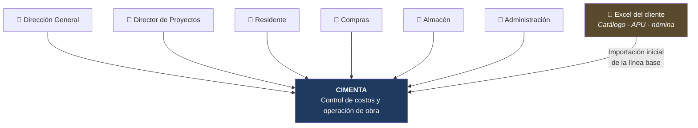
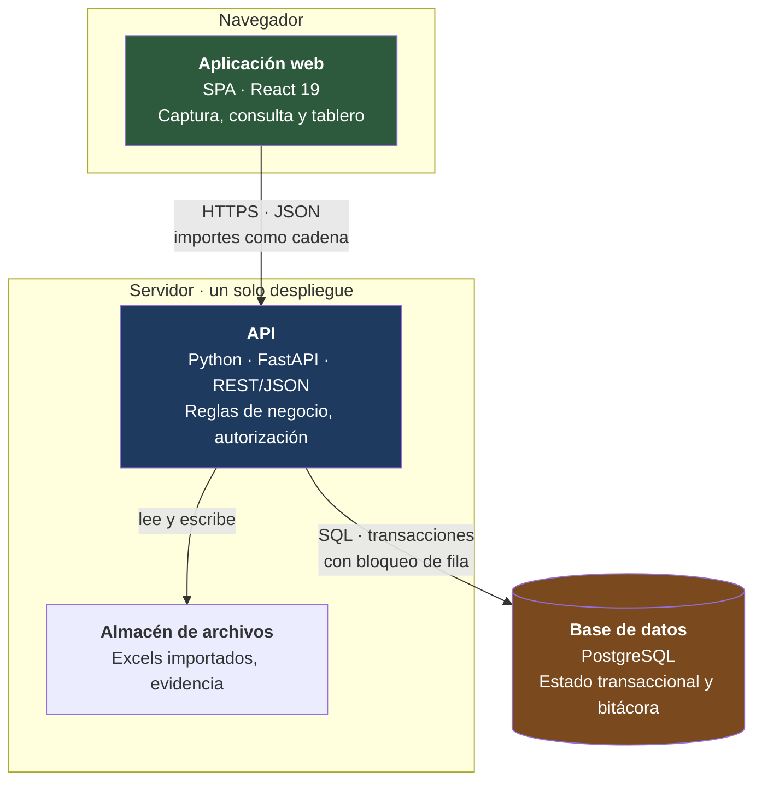
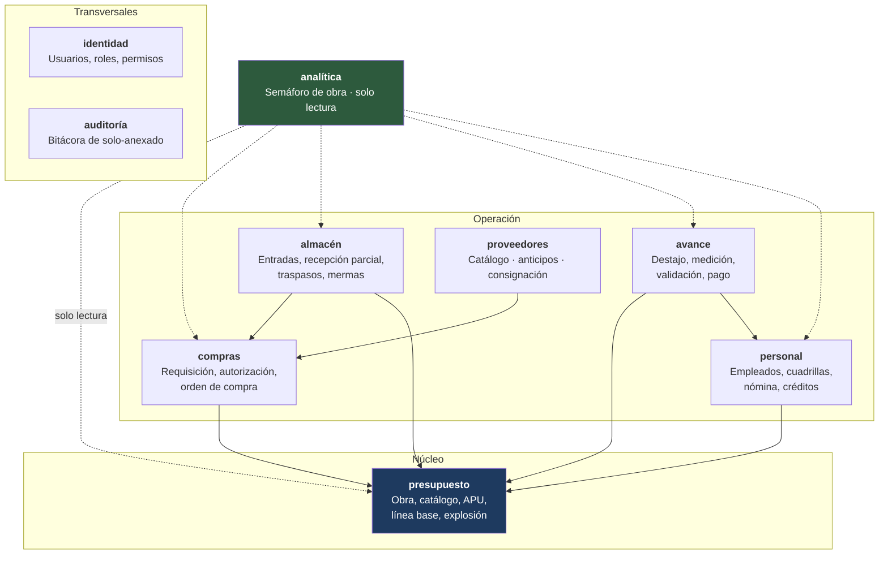
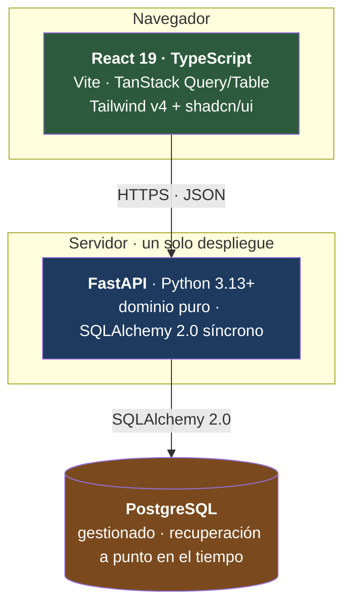
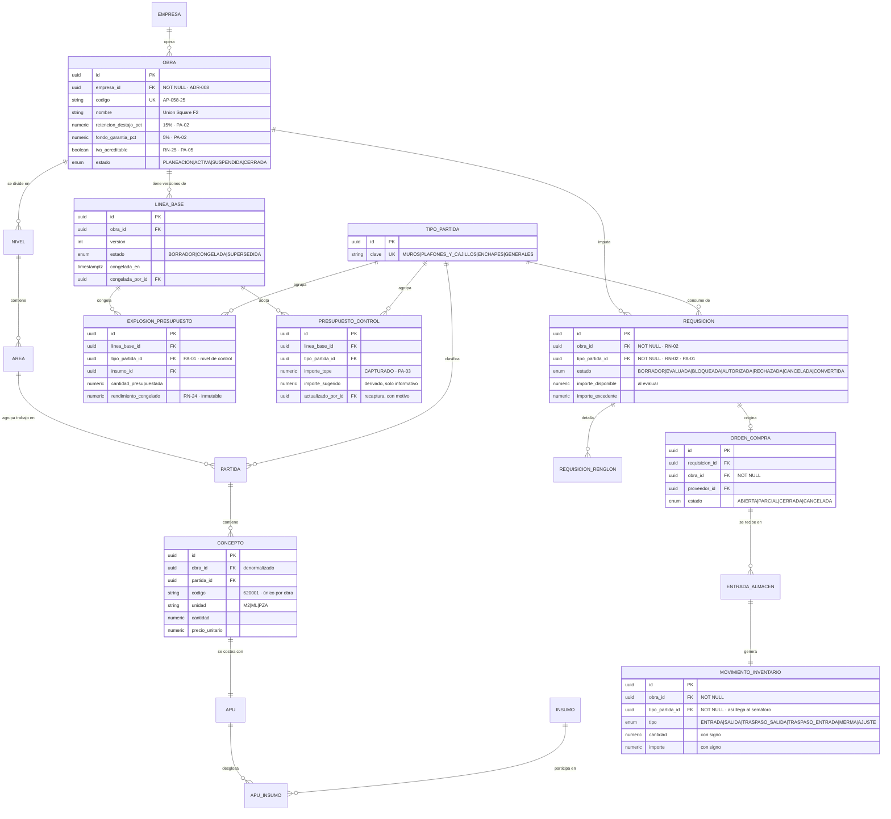

## Índice

0. [Ficha del proyecto](#0-ficha-del-proyecto)
1. [Descripción general del producto](#1-descripción-general-del-producto)
2. [Arquitectura del sistema](#2-arquitectura-del-sistema)
3. [Modelo de datos](#3-modelo-de-datos)
4. [Especificación de la API](#4-especificación-de-la-api)
5. [Historias de usuario](#5-historias-de-usuario)
6. [Tickets de trabajo](#6-tickets-de-trabajo)
7. [Pull requests](#7-pull-requests)

---

## 0. Ficha del proyecto

### **0.1. Tu nombre completo:**

Juan Francisco Rodriguez Silva

### **0.2. Nombre del proyecto:**

**CIMENTA** — plataforma SaaS de control de costos y operación de obra.

El nombre evoca *cimentar*: poner la base sobre la que se sostiene la obra. Es además acrónimo de los dominios que el sistema gobierna: **C**ontrol **I**ntegral de **M**ateriales, **E**stimaciones, **N**ómina y **T**esorería de obr**A**.

### **0.3. Descripción breve del proyecto:**

CIMENTA es un SaaS de control de costos y operación para constructoras de subcontrato especializado —tablaroca, plafones y acabados— que trabajan bajo contratos **a precio alzado máximo garantizado**. En ese esquema el ingreso está fijado desde la firma, así que el único margen que la empresa puede defender es el costo; hoy ese costo vive disperso en hojas de Excel y solo se conoce cuando ya se gastó.

El sistema congela el presupuesto de venta como **línea base inmutable**, sobre ella Dirección captura un **presupuesto de control** interno —el costo tope por obra y tipo de partida— y gobierna con reglas duras todo el gasto que se imputa a cada obra: compras con requisición bloqueada al exceder presupuesto, almacén con recepciones parciales y libro mayor de inventario, subcontratistas por destajo con doble validación de avance, nómina semanal con reparto de costo derivado de la jornada diaria, y un **tablero de Costo Real vs. Costo Presupuestado por obra, en tiempo real**, que es el dato que hoy no existe y que permite a la dirección saber si gana o pierde dinero antes de que se acabe el presupuesto, no después.

El proyecto se desarrolla con **SDD — Spec-Driven Development**: la especificación es el artefacto ejecutable del que se derivan el plan técnico, las tareas y finalmente el código. Toda la especificación se deriva de documentación real de un cliente de la construcción (Constructora Celsius, subcontratista de tablaroca), no de supuestos: un cuestionario de requerimientos respondido por el cliente, presupuestos reales de dos obras (Union Square Fase 2 y ENITI Torre 5) y una hoja de nómina real.

### **0.4. URL del proyecto:**

No aplica todavía. Esta entrega (**Entrega 1**) es **100 % documentación técnica**, sin código ni despliegue. La URL de la aplicación desplegada se añadirá en entregas posteriores.

### 0.5. URL o archivo comprimido del repositorio

**Repositorio:** https://github.com/FranciscoRodSilva/IA4Devs-Proyecto-Final

La documentación completa se desarrolló en la rama `Entrega1` y ya está fusionada a la rama por defecto (`Produccion`) mediante el [PR #1](https://github.com/FranciscoRodSilva/IA4Devs-Proyecto-Final/pull/1) — ver [sección 7](#7-pull-requests). Los archivos fuente del cliente (`Doc de contexto/`) no se versionan por contener datos personales reales (nómina) y precios de obras en curso.

---

## 1. Descripción general del producto

### **1.1. Objetivo:**

> **CIMENTA existe para que la dirección sepa, cualquier día de la semana y sin pedirle nada a nadie, cuánto lleva gastado cada obra contra lo que tenía presupuestado — y para impedir que ese gasto se desvíe sin una autorización explícita y registrada.**

Dos verbos, y el orden importa:

- **Saber.** Convertir el costo de una obra en un dato consultable en tiempo real, no en un ejercicio de reconstrucción contable al cierre.
- **Impedir.** Cuando una operación excede lo presupuestado o un tope pactado, el sistema la **detiene** y exige autorización explícita — nunca deja pasar el gasto con una advertencia que nadie lee.

**El problema que resuelve, con evidencia real del cliente:** el catálogo de conceptos de la obra en curso (4,860 filas) tiene `#REF!` en todas sus columnas de precio y no puede ni sumar su propio total; la mano de obra —entre el 59 % y el 100 % del costo directo— vive en un archivo sin ninguna conexión con el presupuesto; y el sobrecosto de volumen (m² reales contra m² de contrato) se captura cada semana en una hoja y nunca se agrega. El cliente lo resumió así, tres veces, con las mismas palabras: *"No se tiene nada de esto"*.

El producto no sustituye la contabilidad, ni factura al SAT, ni reemplaza el software de presupuestación con el que se arman las licitaciones. Toma el presupuesto como entrada, lo congela como línea base, y gobierna todo lo que ocurre después.

**Para quién:** seis roles internos de la constructora — Dirección General, Director de Proyectos, Residente de obra, Compras, Almacén y Administración. Ningún actor externo (cliente final, proveedor, subcontratista) es usuario del sistema.

### **1.2. Características y funcionalidades principales:**

El producto se organiza en **7 capacidades**, desglosadas en **47 funcionalidades** trazadas a su evidencia en el cuestionario del cliente o en sus archivos reales. El MVP (alcance de esta especificación) cubre el ciclo cerrado *línea base → gasto autorizado → gasto real → avance → tablero*; el resto queda declarado para la versión 1.1.

| Capacidad | Qué resuelve | Alcance MVP |
|---|---|---|
| **C1 · Presupuesto y línea base** | Importa el catálogo y el análisis de precio unitario desde Excel, calcula la explosión de insumos y **congela el presupuesto de venta como línea base inmutable**. Dirección captura aparte el presupuesto de control (el tope real, no derivado) | Importación, explosión, congelado, presupuesto de control por obra y tipo de partida |
| **C2 · Compras y autorizaciones** | Toda requisición se evalúa **automáticamente** contra el presupuesto disponible, en importe y en volumen. La que excede se **bloquea** y abre una solicitud de autorización a Dirección General, nunca pasa con una advertencia | Requisición, bloqueo por presupuesto (`RN-03`), autorización, emisión de orden de compra |
| **C3 · Almacén y materiales** | Entrada validada contra la **remisión del proveedor**, recepciones parciales con saldo pendiente y reprogramación del faltante (nunca cierre con saldo), inventario como libro mayor de solo-anexado | Entrada, recepción parcial, rechazo de excedente |
| **C4 · Destajo y avance de obra** | El residente mide, el Director de Proyectos valida; sin validación no hay pago. Cada etapa de destajo pertenece a una partida, así que su costo llega al tablero agrupado | Avance medido y validado, pago con retención, desviación de volumen (m² real vs. m² contrato) |
| **C5 · Personal y nómina semanal** | Jornada diaria por empleado y obra (la semana va de viernes a jueves), créditos activos descontados automáticamente, y **pagos agrupados** cuando un líder de cuadrilla cobra por terceros sin cuenta bancaria | Completa: es costo directo mayoritario, un tablero sin nómina reportaría la minoría del gasto |
| **C6 · Proveedores** | Catálogo mínimo y consulta de qué y cuánto se pidió a cada proveedor por obra | Catálogo y consulta (facturación, anticipos y consignación quedan en v1.1) |
| **C7 · Tablero de costo real vs. presupuestado** | El **Semáforo de Obra**: una fila por tipo de partida con presupuestado, comprometido, ejercido, avance físico y desviación, calculado en tiempo de consulta y con alerta por umbral | Semáforo, desglose hasta el movimiento, alerta de desviación |

**Reglas duras que atraviesan el producto** (catálogo completo de 25 reglas `RN-01`…`RN-25` en la especificación): la línea base es inmutable; todo gasto lleva `obra_id` y toda requisición además `tipo_partida_id`; los límites **bloquean**, no advierten; toda autorización y excepción queda registrada con actor, momento y motivo; una cuadrilla cobra por destajo **o** por nómina en una semana, nunca por ambas (`RN-22`, para que el costo no se cuente dos veces).

### **1.3. Diseño y experiencia de usuario:**

No aplica en esta entrega. **La Entrega 1 es 100 % documentación técnica** (Specify + Plan + Tasks de Spec-Driven Development): no existe todavía código, interfaz ni despliegue sobre los que capturar imágenes o un video de uso. Los flujos de interacción que va a tener la interfaz están descritos como escenarios Gherkin en la [sección 5](#5-historias-de-usuario) y en el documento completo de [historias de usuario](https://github.com/FranciscoRodSilva/IA4Devs-Proyecto-Final/blob/Produccion/docs/04-historias-usuario.md). Esta sección se completará con capturas y/o video en la entrega en que exista una interfaz funcional.

### **1.4. Instrucciones de instalación:**

No aplica en esta entrega, por la misma razón: no hay backend, frontend, base de datos ni migraciones que instalar todavía. El [stack tecnológico](https://github.com/FranciscoRodSilva/IA4Devs-Proyecto-Final/blob/Produccion/docs/06-stack-tecnologico.md) y los comandos de arranque previstos ya están decididos y documentados (Python 3.13+ · FastAPI · SQLAlchemy 2.0 síncrono · PostgreSQL · React 19 · Vite), y el primer ticket de la Épica 0 (`TKT-001`) es precisamente crear la estructura instalable del repositorio. Esta sección se completará con los pasos verificados en una máquina limpia en cuanto exista esa estructura.

---

## 2. Arquitectura del Sistema

### **2.1. Diagrama de arquitectura:**

**Estilo elegido: monolito modular**, con PostgreSQL como único motor de persistencia y una SPA de React consumiendo una API REST.





**Por qué monolito modular y no microservicios.** La operación central del sistema —evaluar una requisición contra el presupuesto y registrar el resultado— tiene que ser **atómica**. Si `compras` y `presupuesto` fueran servicios separados, esa atomicidad exigiría transacciones distribuidas o consistencia eventual, y la consistencia eventual permite que dos requisiciones concurrentes pasen ambas y sobregiren la partida — exactamente lo que el producto existe para impedir. A eso se suma que la carga real es de decenas de operaciones por hora: microservicios comprarían independencia de despliegue que nadie necesita, al precio de la garantía que sí se necesita.

**Beneficios que aporta:** una única transacción con bloqueo de fila para la operación crítica; un solo artefacto que desplegar y operar (un único desarrollador); fronteras internas explícitas (verificadas en CI con `import-linter`) que acotan el contexto sobre el que trabaja un agente de IA al implementar cada módulo.

**Sacrificios conscientes:** no hay independencia de despliegue entre módulos, ni escalado independiente por capacidad — aceptable porque el sistema no es de alto volumen (~4,900 conceptos por obra, decenas de escrituras diarias), sino de alta exigencia en integridad y trazabilidad. Un único despliegue implica también que una caída deja el sistema entero fuera; se acepta y se declara en `RNF-12`, compensado por el objetivo de recuperación de `RNF-10`.

### **2.2. Descripción de componentes principales:**



| Módulo | Responsabilidad | Depende de |
|---|---|---|
| **identidad** | Autenticación, roles y permisos por rol | — |
| **auditoría** | Bitácora inmutable de toda acción relevante (`RN-04`) | — |
| **presupuesto** (núcleo) | Obra, jerarquía, conceptos, APU, línea base, explosión por tipo de partida, presupuesto de control | — |
| **compras** | Requisición, evaluación presupuestal, autorización, orden de compra | presupuesto |
| **almacén** | Entrada contra remisión, recepción parcial, traspasos, mermas, inventario (libro mayor) | compras, presupuesto |
| **avance** | Alcance de destajo, medición, doble validación, pago con retención y fondo de garantía | presupuesto, personal |
| **personal** | Empleados, roles de oficio, cuadrillas, créditos, nómina semanal, pagos agrupados | presupuesto |
| **proveedores** | Catálogo; facturación, anticipos y consignación (v1.1) | compras |
| **analítica** (Semáforo) | Agregación de costo real vs. presupuestado, **solo lectura** de todos los demás | todos (solo lectura) |

**La regla que sostiene todo el conjunto:** un módulo solo puede hablar con otro a través de su interfaz de aplicación publicada, nunca a través de sus repositorios, modelos o tablas. Es lo único que separa un monolito modular de un monolito con carpetas, y se verifica automáticamente en CI.

### **2.3. Descripción de alto nivel del proyecto y estructura de ficheros**

Cada módulo del backend replica la misma estructura interna de cuatro capas, con la dependencia apuntando siempre hacia dentro (la infraestructura conoce al dominio; el dominio no conoce a nadie):

```
backend/cimenta/
├── identidad/
├── auditoria/
├── presupuesto/            ← núcleo, no depende de nadie
├── compras/
├── almacen/
├── avance/
├── personal/
├── proveedores/
└── analitica/               ← solo lectura de todos los demás
    └── <cada módulo>/
        ├── api/              Rutas HTTP, DTO (Pydantic), códigos de estado
        ├── aplicacion/       Casos de uso: abre transacción, orquesta. NO decide reglas
        ├── dominio/          Reglas de negocio puras. Sin framework, sin ORM, sin HTTP
        └── infraestructura/  Modelos SQLAlchemy, repositorios, adaptadores

frontend/
└── src/
    ├── modulos/              Un directorio por módulo de negocio, calcado del backend
    ├── componentes/          Reutilizables: pantalla de bloqueo, formulario de catálogo, captura de motivo
    └── api/                  Cliente generado del OpenAPI (openapi-typescript + openapi-fetch)

docs/                        Especificación completa (esta entrega)
├── 01-descripcion-producto.md … 06-stack-tecnologico.md
├── adr/                      15 decisiones de arquitectura (formato MADR)
├── glosario.md · convenciones.md
tools/                        Verificadores de la documentación (enlaces, anclas, conteos, diagramas)
```

**Por qué el dominio es puro.** Las 25 reglas de negocio (`RN-01`…`RN-25`) tienen que poder probarse con los 137 escenarios de aceptación sin levantar servidor ni base de datos. Una regla enterrada en un controlador solo se puede probar por HTTP: lento, frágil y mezclada con serialización y autenticación. La consecuencia práctica es que **cada regla es localizable en el código por su identificador** (`RN-03` vive en `compras/dominio/`), lo que hace la trazabilidad especificación ↔ código verificable, no solo declarada.

### **2.4. Infraestructura y despliegue**



**Local:** Docker Compose con un único servicio (PostgreSQL con volumen persistente); backend y frontend corren en el anfitrión con `uv` y Vite.

**Integración continua:** GitHub Actions — tests de backend contra PostgreSQL real (nunca SQLite), tests de frontend, contratos de fronteras entre módulos (`import-linter`), calidad documental, auditoría de dependencias (`pip-audit`, `npm audit`) y la prueba de rendimiento del semáforo (`RNF-15`, < 2 s).

**Despliegue previsto:** **una sola imagen de Docker** con el backend sirviendo también los estáticos del frontend ya compilado, más PostgreSQL gestionado. Es coherente con el monolito modular y con el despliegue **de un solo inquilino** ([ADR-008](https://github.com/FranciscoRodSilva/IA4Devs-Proyecto-Final/blob/Produccion/docs/adr/20260918-despliegue-single-tenant.md)): cada instalación de CIMENTA atiende a una sola constructora, aunque el esquema ya lleva `empresa_id` desde el día uno para que una futura migración a multi-inquilino sea un cambio de política de acceso, no una reescritura. El destino concreto (VPS con Compose o plataforma gestionada) se decide en una entrega posterior; lo que ya queda fijado es la forma del artefacto, porque condiciona cómo se construye.

**Respaldo y recuperación:** recuperación a un punto en el tiempo del PostgreSQL gestionado más un volcado lógico diario aparte (dos fallos distintos: disco perdido vs. cuenta del proveedor comprometida). Objetivos propuestos —≤ 1 hora de pérdida, ≤ 8 horas de restauración (`RNF-10`)— quedan **(asumidos)** y planteados a Dirección General como pregunta abierta `PA-12`, porque fijan el precio de la infraestructura contratada.

**Operación sin conexión.** En la obra no hay internet (confirmado por el cliente, `PA-13`). Solo dos flujos —avance de destajo y entrada de material— se capturan sin conexión y se sincronizan después, encolados en el cliente y evaluados siempre contra las mismas reglas del servidor al reconectar: el cliente nunca evalúa una regla de negocio. Detalle en [ADR-015](https://github.com/FranciscoRodSilva/IA4Devs-Proyecto-Final/blob/Produccion/docs/adr/20260919-captura-diferida-sin-conexion.md).

### **2.5. Seguridad**

Dieciocho requisitos no funcionales declarados en la especificación (`RNF-01`…`RNF-18`), de los que **catorce se verifican con una prueba automática** en CI. Las prácticas principales:

- **Sesión con estado en el servidor**, no JWT ni cookie autocontenida ([ADR-014](https://github.com/FranciscoRodSilva/IA4Devs-Proyecto-Final/blob/Produccion/docs/adr/20260919-sesion-con-estado.md)). La cookie transporta solo un identificador opaco contra una tabla `sesion`: cerrar sesión, desactivar un usuario o quitarle un rol surte efecto en la petición siguiente. En un sistema donde el rol decide quién autoriza un sobregiro, esa revocación inmediata no es negociable.
- **Contraseñas con `pwdlib[argon2]`** (Argon2id), nunca `passlib`. El inicio de sesión siempre verifica un hash, exista el usuario o no, para que el tiempo de respuesta no revele qué cuentas existen.
- **Autoridad sobre la excepción, en el dominio.** Nadie autoriza su propia solicitud — se comprueba en `dominio/`, no ocultando un botón en la interfaz, porque es una regla de negocio y tiene que poder probarse sin HTTP.
- **CSRF por token de doble envío** en todo método que muta estado, más `SameSite=Lax` como defensa adicional (no `Strict`, para no desconectar al usuario que abre un enlace desde el correo).
- **Privilegio mínimo en el motor, con tres roles de PostgreSQL:** migración (propietario del esquema), aplicación (sin `UPDATE`/`DELETE` sobre la bitácora ni los intentos de acceso) y solo-lectura (con el que se conecta `analitica`, haciendo verificable que solo lee).
- **Archivos y secretos:** los archivos subidos se validan por tipo y tamaño y se sirven siempre como descarga; los secretos se leen del entorno con `pydantic-settings`, que impide arrancar sin ellos.
- **Auditoría de dependencias** (`pip-audit`, `npm audit`) fallando el pipeline ante severidad alta — relevante porque buena parte del código lo van a escribir agentes de IA, que añaden dependencias con la misma facilidad con la que escriben una función.

### **2.6. Tests**

La estrategia de testing está decidida aunque el código todavía no exista (Entrega 1 = documentación):

- **Dominio:** pytest puro, sin base de datos ni HTTP — las 25 reglas de negocio en milisegundos.
- **Integración:** pytest + testcontainers contra **PostgreSQL real**, nunca SQLite — el bloqueo pesimista, el decimal exacto y 22 invariantes viven en garantías del motor que SQLite no tiene.
- **Concurrencia:** pytest con dos sesiones reales y simultáneas para el escenario de requisiciones concurrentes de HDU-002 (el que prueba de verdad el bloqueo pesimista).
- **Frontend:** Vitest + Testing Library para componentes; Playwright para los dos recorridos con consecuencia real (importar y congelar una línea base; requisición que se bloquea y acaba autorizada).
- **Trazabilidad escenario ↔ test:** en vez de `pytest-bdd`, una convención de nombres (`test_hdu002_esc04_...`) más un verificador en CI que recorre los 137 escenarios Gherkin de la especificación y falla el pipeline si alguno se queda sin test — es lo que convierte la regla *"una historia se acepta solo si todos sus escenarios pasan en verde"* en algo comprobable y no solo una intención.
- **Documentación como código, ya en uso:** `tools/verificar_docs.py` y `tools/extraer_mermaid.py` viven en el repositorio y validan en cada cambio enlaces, anclas, identificadores (`RN`, `HDU`, `TKT`, invariantes), conteos y sintaxis de los 26 diagramas Mermaid.

---

## 3. Modelo de Datos

### **3.1. Diagrama del modelo de datos:**

**Motor:** PostgreSQL, elegido antes que el resto del stack porque varias decisiones estructurales dependen de sus garantías (`SELECT … FOR UPDATE`, `NUMERIC` de precisión fija, restricciones `CHECK`, índices únicos parciales). El esquema completo tiene 9 diagramas ER; el núcleo —jerarquía, catálogo y línea base— es este:



El esquema completo —9 diagramas, incluidos avance/destajo, personal/nómina, proveedores e identidad/auditoría— está en [`docs/03-modelo-datos.md`](https://github.com/FranciscoRodSilva/IA4Devs-Proyecto-Final/blob/Produccion/docs/03-modelo-datos.md).

### **3.2. Descripción de entidades principales:**

**`obra`** — la unidad de negocio sobre la que se imputa todo gasto. Lleva `empresa_id` obligatorio (aunque el despliegue sea de un solo inquilino, ver ADR-008), `codigo` único, y dos porcentajes que el cliente confirmó como **conceptos distintos** (`PA-02`): `retencion_destajo_pct` (15 % operativo, en cada pago semanal) y `fondo_garantia_pct` (5 % contractual, liberable solo al entregar y cobrar). `iva_acreditable` es booleano por obra (`PA-05`, `RN-25`), no una constante del sistema. Estado: `PLANEACION → ACTIVA → SUSPENDIDA/CERRADA`.

**`linea_base`** — la copia física e inmutable del presupuesto de venta al momento de congelar. Solo una fila por obra puede estar en estado `CONGELADA` a la vez (índice único parcial, invariante 5), y un **disparador** rechaza cualquier `UPDATE`/`DELETE` sobre sus copias (`linea_base_concepto`, `explosion_presupuesto`) mientras está congelada (invariante 14) — es el único invariante que necesita disparador porque PostgreSQL no tiene forma nativa de marcar filas como inmutables.

**`presupuesto_control`** — el tope de gasto interno por obra y tipo de partida (`UNIQUE (linea_base_id, tipo_partida_id)`, invariante 6). A diferencia de la línea base, **se captura** (no se deriva del precio de venta, `PA-03`) y **sí se puede recapturar**, exigiendo motivo y quedando asentada con la regla `RN-03` en la bitácora — porque subir un tope sin dejar rastro es una vía silenciosa de saltarse una autorización.

**`requisicion`** — el punto donde el gasto se puede detener antes de producirse. `obra_id` y `tipo_partida_id` son `NOT NULL` (invariante 1, `RN-02`). Su máquina de estados distingue explícitamente `CANCELADA` (el solicitante desistió) de `RECHAZADA` (Dirección General negó una excepción), porque mezclarlas contaminaría la consulta de excepciones de `RN-04`. Solo cancelar libera el presupuesto que retiene.

**`movimiento_inventario`** — el libro mayor de solo-anexado del almacén: no existe columna de existencia; el saldo es `SUM(cantidad)` sobre los movimientos. Lleva `tipo_partida_id` propio (no derivado de una orden), porque un `AJUSTE` o una `MERMA` no siempre cuelgan de una orden de compra y sin esa columna la corrección desaparecería del ejercido del semáforo.

**`jornada`** — nace de `PA-04`: un registro por empleado, día **y obra**. Es lo que permite que el costo de nómina se reparta entre obras como un dato derivado (`imputacion_nomina_obra`, en proporción a los días trabajados) y no como una estimación manual. `UNIQUE (empleado_id, fecha)` (invariante 16) impide que un empleado tenga dos jornadas el mismo día.

**`bitacora`** — de solo-anexado (el rol de aplicación tiene `INSERT`/`SELECT`, nunca `UPDATE`/`DELETE`, invariante 10), escrita en la **misma transacción** que el cambio que audita. Lleva `regla_negocio` para poder responder *"¿cuántas veces se intentó sobregirar una partida este mes y quién lo autorizó?"* con una sola consulta.

El esquema declara **22 invariantes** directamente en el motor (restricciones `CHECK`, índices únicos, disparadores y permisos) porque, según el principio de diseño del proyecto, *"un invariante que solo vive en el código de aplicación se rompe el día que alguien escribe por otra vía"*.

---

## 4. Especificación de la API

Esta entrega (Entrega 1, 100 % documentación) no incluye todavía código ni, por tanto, un backend que sirva una API en firme. La **forma** del contrato ya está decidida en [`docs/02-arquitectura.md` §7.3](https://github.com/FranciscoRodSilva/IA4Devs-Proyecto-Final/blob/Produccion/docs/02-arquitectura.md#73-contrato-de-error-de-regla-de-negocio) y el framework (FastAPI, con generación automática de OpenAPI) en [`docs/06-stack-tecnologico.md`](https://github.com/FranciscoRodSilva/IA4Devs-Proyecto-Final/blob/Produccion/docs/06-stack-tecnologico.md). Los tres endpoints más representativos del flujo central, tal como quedaron especificados en los diagramas de secuencia de la arquitectura, son:

```yaml
openapi: 3.0.3
info:
  title: CIMENTA API (borrador de especificación — sin implementar aún)
  version: "0.1.0"
paths:
  /obras/{obra_id}/requisiciones:
    post:
      summary: Levantar una requisición de material contra el presupuesto de una obra
      description: >
        Evalúa la requisición contra el presupuesto disponible del tipo de partida
        (importe y volumen) en una única transacción con bloqueo de fila. RN-03.
      requestBody:
        content:
          application/json:
            example:
              tipo_partida_id: "b2a1..."
              renglones:
                - insumo_id: "f0e3..."
                  cantidad: "25.0000"
      responses:
        "201":
          description: Requisición evaluada y aceptada (estado EVALUADA)
        "409":
          description: Requisición bloqueada por exceder el presupuesto disponible
          content:
            application/json:
              example:
                tipo: "REGLA_NEGOCIO"
                regla: "RN-03"
                mensaje: "La requisición excede el presupuesto de control disponible del tipo de partida MUROS."
                detalle:
                  obra: "AP-058-25 · Union Square F2"
                  tipo_partida: "MUROS"
                  presupuestado: "45000.0000"
                  consumido: "33000.0000"
                  disponible: "12000.0000"
                  solicitado: "15000.0000"
                  excedente: "3000.0000"
                acciones:
                  - clave: "SOLICITAR_AUTORIZACION"
                    metodo: "POST"
                    ruta: "/requisiciones/1042/autorizacion"

  /obras/{obra_id}/almacen/entradas:
    post:
      summary: Registrar la entrada de material recibido, validada contra la remisión del proveedor
      description: >
        Acepta recepciones parciales dejando la orden en estado PARCIAL con su saldo
        pendiente (RN-06). Rechaza cantidades que excedan lo ordenado (RN-07).
      requestBody:
        content:
          application/json:
            example:
              orden_compra_id: "a71c..."
              folio_remision: "REM-0231"
              renglones:
                - insumo_id: "f0e3..."
                  cantidad: "50.0000"
      responses:
        "201":
          description: Entrada registrada; el saldo pendiente y el estado de la orden se derivan
        "409":
          description: Cantidad recibida excede lo ordenado y no autorizado (RN-07)

  /obras/{obra_id}/semaforo:
    get:
      summary: Consultar el Semáforo de Obra — costo real vs. presupuestado por tipo de partida
      description: >
        Cuatro filas por obra (una por tipo de partida). Se calcula en tiempo de
        consulta, sin proceso por lotes. Responde en menos de 2 s (RNF-15).
      responses:
        "200":
          description: Semáforo de la obra
          content:
            application/json:
              example:
                obra: "AP-058-25 · Union Square F2"
                partidas:
                  - tipo_partida: "MUROS"
                    presupuestado: "450000.0000"
                    comprometido: "80000.0000"
                    ejercido: "330000.0000"
                    avance_fisico: "0.400000"
                    desviacion: "150000.0000"
                nomina_no_imputada: "22000.0000"
        "403":
          description: El usuario no tiene permiso sobre esa obra
```

Los importes viajan siempre como **cadena** (nunca como número JSON) para no pasar por el flotante de doble precisión de JavaScript; es una propiedad que Pydantic v2 aplica de forma nativa al serializar `Decimal`, y los tipos del cliente se generan directamente del OpenAPI que FastAPI publica, sin duplicar el contrato a mano.

---

## 5. Historias de Usuario

> Se documentan 3 de las 9 historias del backlog. El conjunto completo (137 escenarios de aceptación) está en [`docs/04-historias-usuario.md`](https://github.com/FranciscoRodSilva/IA4Devs-Proyecto-Final/blob/Produccion/docs/04-historias-usuario.md). **Regla de aceptación del proyecto:** una historia se acepta únicamente si *todos* sus escenarios pasan en verde — los de éxito y los de error por igual.

**Historia de Usuario 1 — HDU-001 · Alta de obra e importación de la línea base**

*Como* Director de Proyectos *quiero* dar de alta una obra, importar desde Excel su catálogo de conceptos con los análisis de precios unitarios, revisarlo antes de aceptarlo y congelarlo *para* que exista una referencia inmutable contra la que medir toda desviación de costo.

Prioridad **Must** · Complejidad Alta · **13 SP** · 23 escenarios de aceptación.

Escenarios representativos:
- **Escenario 4 (carga):** dado un archivo Excel seleccionado, el sistema registra la importación en estado `ANALIZANDO` sin bloquear la pantalla.
- **Escenario 6 (rechazo — archivo real roto):** dado que el archivo contiene celdas `#REF!` en las columnas de precio (como el catálogo real de Union Square), la importación pasa a `CON_ERRORES`, genera un renglón de error por fila afectada y **no** permite confirmar.
- **Escenario 12 (rechazo — fallo a mitad de escritura):** si la confirmación se interrumpe en el registro 3,000 de 4,900, ningún dato queda persistido; la importación vuelve a `VALIDADO`.
- **Escenario 14 (éxito):** al congelar, el sistema copia conceptos y explosión agregada **por tipo de partida** a la línea base, que queda `CONGELADA` con fecha, usuario y motivo.
- **Escenario 18 (rechazo):** cualquier intento de modificar una línea base ya congelada es rechazado por la base de datos, no por la aplicación.

*Non-goals:* no genera el presupuesto (solo lo importa), no permite editar conceptos desde la interfaz (una corrección se hace reimportando), no permite tocar la línea base congelada.

---

**Historia de Usuario 2 — HDU-002 · Requisición con control de presupuesto**

*Como* responsable de Compras *quiero* levantar una requisición de material imputada a una obra y una partida *para* que el sistema verifique si cabe en el presupuesto **antes** de que el gasto se comprometa.

Prioridad **Must** · Complejidad Alta · **8 SP** · 13 escenarios de aceptación.

Escenarios representativos:
- **Escenario 4 (rechazo por importe):** una requisición de $15,000 contra $12,000 disponibles queda `BLOQUEADA`, crea una solicitud de autorización a Dirección General y responde `409` con el contrato de error completo (disponible, excedente, acciones).
- **Escenario 5 (rechazo por volumen):** una requisición cuyo importe cabe en el tope puede bloquearse igual si excede la **cantidad** presupuestada de un insumo — el control es doble, importe y volumen.
- **Escenario 9 (concurrencia — el corazón de la historia):** dos requisiciones simultáneas de $8,000 contra $12,000 disponibles: el sistema garantiza que **nunca** pasan las dos, mediante bloqueo pesimista de fila.
- **Escenario 11 (cancelación):** solo cancelar una requisición libera de inmediato el presupuesto que retenía; el estado es `CANCELADA`, nunca `RECHAZADA` (que es una decisión de Dirección sobre una excepción).

*Non-goals:* no resuelve la autorización (HDU-003), no emite la orden de compra (HDU-004), no implementa umbrales de autorización por monto.

---

**Historia de Usuario 3 — HDU-006 · Semáforo de obra**

*Como* Dirección General *quiero* ver por obra y partida cuánto se presupuestó, cuánto está comprometido, cuánto se ha ejercido y cuál es la desviación frente al avance físico *para* saber si estoy ganando o perdiendo dinero antes de que se acabe el presupuesto.

Prioridad **Must** · Complejidad Media · **5 SP** · 13 escenarios de aceptación. Es el entregable central del producto.

Escenarios representativos:
- **Escenario 3 (el caso que justifica el producto):** una partida presupuestada en $100,000 con 40 % de avance físico y $70,000 ejercidos sale en **rojo** con $30,000 de desviación, aunque el plazo de la obra no se haya agotado — hoy ese dato es invisible hasta el cierre.
- **Escenario 5 (mano de obra sin partida):** la nómina imputada a la obra aparece en fila propia, marcada como no imputada a partida, y entra en el total sin repartirse ni afectar las desviaciones por partida individuales.
- **Escenario 6 (transparencia sobre datos incompletos):** si la obra aún no tiene nómina ni destajo registrado, el ejercido se muestra con un aviso explícito de qué fuentes faltan, y **nunca** se presenta como costo real completo.
- **Escenario 9 (rechazo silencioso evitado):** una partida sin avance validado muestra desviación **"no calculable"**, no cero — un cero haría que la desviación pareciera igual al ejercido, marcando en rojo una partida que simplemente no se ha medido todavía.
- **Escenario 13:** cuatro filas por obra (una por tipo de partida), nunca una fila por cada una de las 143 ubicaciones — es lo que hace la consulta trivial de leer y de responder en menos de 2 segundos.

*Non-goals:* no recalcula el costo proyectado ante alzas de precio (v1.1), no exporta a Excel/PDF, no incluye vista consolidada multi-obra más allá del resumen de alertas.

---

## 6. Tickets de Trabajo

> Se documentan 3 tickets — uno de base de datos, uno de backend y uno de frontend — que en conjunto implementan HDU-002. El backlog completo tiene 58 tickets en 8 sprints ([`docs/05-tickets-trabajo.md`](https://github.com/FranciscoRodSilva/IA4Devs-Proyecto-Final/blob/Produccion/docs/05-tickets-trabajo.md)). Los story points viven en la historia, no en el ticket; cada ticket lleva una talla indicativa (S/M/L).

**Ticket 1 — TKT-019 · Esquema y migraciones del módulo compras** *(Base de datos · Talla S · depende de TKT-011)*

**Qué hace.** Crea el esquema relacional que sostiene HDU-002: tablas `requisicion`, `requisicion_renglon`, `solicitud_autorizacion`, `orden_compra`, `orden_compra_renglon`.

**Criterios técnicos:**
- `obra_id` y `tipo_partida_id` con restricción `NOT NULL` en `requisicion` (invariante 1, `PA-01`).
- El estado de `requisicion` distingue explícitamente `RECHAZADA` (decisión de Dirección) de `CANCELADA` (el solicitante desistió), para no contaminar la consulta de excepciones de `RN-04`.
- `CHECK (cantidad >= 0)` y `CHECK (costo_unitario >= 0)` en los renglones (invariante 8).
- `CHECK (cantidad_recibida <= cantidad_ordenada)` en `orden_compra_renglon` (invariante 2, `RN-07`).
- `orden_compra` **no** tiene columna de motivo de cierre: no existe el cierre con saldo (`PA-07`).
- `solicitud_autorizacion` modelada de forma **genérica** (sin acoplarse a requisiciones), porque HDU-005 y HDU-008 la reutilizan.

**Non-goals:** no implementa ninguna lógica; solo esquema y migraciones.

---

**Ticket 2 — TKT-021 · Caso de uso con bloqueo pesimista** *(Backend · Talla M · depende de TKT-019, TKT-020, TKT-007)*

**Qué hace.** Implementa la transacción completa que evalúa una requisición: bloquea las filas de presupuesto, calcula el consumido, decide, persiste y escribe bitácora — todo en una sola unidad de trabajo.

**Criterios técnicos:**
- Una sola transacción: `SELECT … FOR UPDATE` sobre `presupuesto_control` (control por importe) y `explosion_presupuesto` (control por volumen), lee consumido, evalúa, persiste y escribe bitácora.
- El `consumido` se calcula con la **misma consulta** que alimenta el semáforo (`requisiciones vivas + comprometido + ejercido`), para que el disponible que ve Compras en pantalla sea el mismo que la regla aplica.
- Los bloqueos se toman **siempre ordenados por identificador de tipo de partida**, para evitar interbloqueo.
- La requisición bloqueada se **persiste** (estado `BLOQUEADA` con las cifras del momento), nunca se descarta.
- Un test verifica que dos requisiciones de $8,000 contra $12,000 disponibles **no pasan las dos** — es el escenario 9 de HDU-002 y solo funciona si las requisiciones vivas consumen.
- El vencimiento de `lock_timeout` se traduce al contrato de error con acción de reintentar, nunca a un `500` (`RNF-16`).

**Non-goals:** no resuelve la autorización (HDU-003); no emite orden de compra (HDU-004).

---

**Ticket 3 — TKT-024 · Interfaz de captura de requisición** *(Frontend · Talla M · depende de TKT-023, TKT-008)*

**Qué hace.** Pantalla donde Compras levanta una requisición, ve el presupuesto disponible antes de capturar y recibe el bloqueo con su explicación si la requisición no cabe.

**Criterios técnicos:**
- Al seleccionar obra y partida, muestra presupuestado, consumido —desglosado en requisiciones vivas, saldo de órdenes y ejercido— y disponible **antes** de capturar ningún renglón.
- Lista de requisiciones evaluadas sin convertir, con acción de cancelarlas para liberar presupuesto retenido.
- Captura de renglones con insumo y cantidad, mostrando la cantidad disponible de cada insumo (control por volumen, no solo importe).
- Al bloquearse, usa el componente reutilizable de **pantalla de bloqueo** (de TKT-008) mostrando disponible, excedente e insumo culpable, con el botón de "Solicitar autorización" leído directamente de las `acciones` del contrato de error, no cableado a mano.
- Los importes se calculan con decimal exacto en el cliente (`decimal.js`), nunca con `Number`.

**Non-goals:** no incluye la bandeja de autorizaciones (HDU-003).

---

## 7. Pull Requests

> En esta entrega (100 % documentación) se completó **un único Pull Request** real, que integra el trabajo de las cuatro sesiones de especificación en la rama por defecto del repositorio. Las entregas siguientes, con código, generarán PRs adicionales por funcionalidad.

**Pull Request 1 — [#1 · Entrega 1 · Documentación técnica completa de CIMENTA](https://github.com/FranciscoRodSilva/IA4Devs-Proyecto-Final/pull/1)**

`Entrega1` → `Produccion` · mergeado el 2026-09-21 · +7,729 / −0 líneas · 32 archivos.

**Qué trae.** La especificación completa de CIMENTA derivada con Spec-Driven Development a partir de documentación real del cliente: ficha del proyecto, PRD (25 reglas de negocio, 18 requisitos no funcionales), arquitectura (monolito modular, contrato de error), modelo de datos (22 invariantes en base de datos), 9 historias de usuario con 137 escenarios de aceptación, 58 tickets en 8 sprints, stack tecnológico con 15 ADRs, glosario y convenciones de trabajo, y los verificadores propios de documentación en `tools/`.

**Un detalle relevante de la propia PR:** los archivos fuente del cliente (`Doc de contexto/`) no se versionan porque la nómina lleva nombres y salarios de trabajadores reales, y los presupuestos, precios unitarios de obras en curso — el repositorio es público y `RNF-07` prohíbe publicarlos. El PR ajustó las cuatro referencias que enlazaban esa carpeta (README, PRD, convenciones, `llms.txt`) para que **declaren la exclusión** en vez de apuntar a rutas que habrían quedado rotas en CI.

**Verificación antes de mergear:** `python tools/verificar_docs.py` — 236 enlaces relativos, 141 anclas internas, 25 reglas, 18 requisitos no funcionales, 13 preguntas, 47 funcionalidades, 9 historias, 58 tickets, 15 ADRs, 22 invariantes, 70 story points, 137 escenarios, sin problemas.

**Lo que queda abierto tras el merge:** la pregunta `PA-12` (objetivo de recuperación ante desastres, que fija el precio de la infraestructura) y el bloque de backlog de captura sin conexión, declarado pero todavía sin descomponer en tickets.

**Pull Request 2** — Pendiente. No existe todavía un segundo PR: esta entrega es 100 % documentación y se integró en un solo Pull Request. El siguiente PR real llegará con la primera funcionalidad de código (Épica 0 de fundación, `TKT-001`…`TKT-010`).

**Pull Request 3** — Pendiente, por la misma razón que el anterior.
